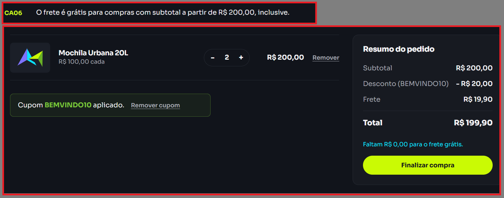
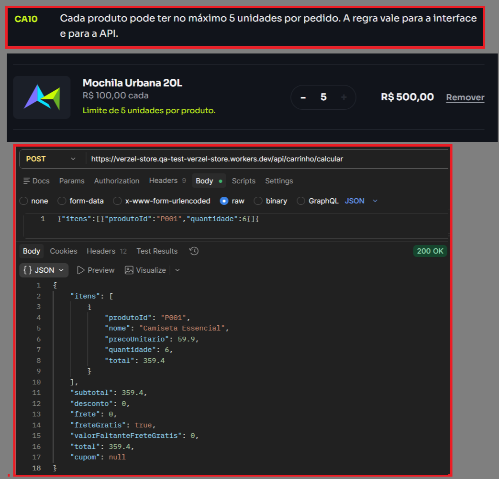

# Bugs reproduzidos nesta execução

Os relatos abaixo se baseiam em verificações próprias da [Verzel Store](https://verzel-store.qa-test-verzel-store.workers.dev/) pela interface e pela API. BUG-01/02 reprovam critérios de aceite; BUG-04 e BUG-06 divergem de contratos documentados; BUG-03/05 são achados exploratórios, com o limite de interpretação explicitado em cada relato. A classificação não presume causa interna.

## BUG-01

**Frete de R$ 19,90 cobrado quando subtotal é exatamente R$ 200,00.** Critério CA06; severidade **alta**; prioridade sugerida **alta**.

**Pré-condição:** carrinho novo, sem cupom. **Passos:** adicionar duas unidades de Mochila Urbana 20L (P005, R$ 100,00 cada); abrir carrinho. Repetir `POST /api/carrinho/calcular` com `{"itens":[{"produtoId":"P005","quantidade":2}]}` e `POST /api/pedidos` com o mesmo item e cliente válido.

**Esperado:** frete R$ 0,00, `freteGratis: true`, total R$ 200,00, sem aviso de valor faltante. A documentação diz “a partir de R$ 200,00, inclusive”.

**Observado:** interface e as duas respostas da API cobram frete R$ 19,90 e total R$ 219,90. O cálculo devolveu `valorFaltanteFreteGratis: 0` junto de `freteGratis: false`; a tela mostrou “Faltam R$ 0,00 para o frete grátis.” O pedido foi confirmado com o mesmo frete cobrado.

**Impacto:** cliente paga R$ 19,90 além do valor anunciado para um carrinho exatamente no limite. O cenário com R$ 199,90 passou, e R$ 219,80 com cupom continuou com frete grátis; a falha observada concentra-se na borda inclusiva.

**Evidências:** [cálculo real](../evidencias/api/API-07.json), [pedido real](../evidencias/api/API-24.json), [captura automatizada](../evidencias/ui/UI-02-frete-limite.png), [captura manual](../evidencias/manuais/CA06.png) e testes API-07/API-24/UI-02 no [relatório atual](../evidencias/relatorio-playwright/index.html). O cenário [CT07](../cenarios/frete.feature) permanece reprovado.

*Captura manual do CA06: mesmo com cupom, a regra de frete deve considerar o subtotal anterior ao desconto.*

## BUG-02

**API aceita seis unidades do mesmo produto no cálculo e na confirmação.** Critério CA10; severidade **alta**; prioridade sugerida **alta**.

**Pré-condição:** produto P001 disponível e cliente válido para o pedido. **Passos:** enviar `POST /api/carrinho/calcular` com `{"itens":[{"produtoId":"P001","quantidade":6}]}`; repetir em `POST /api/pedidos` incluindo nome, e-mail e CEP válidos.

**Esperado:** os dois endpoints respondem 422 com `erro.codigo: QUANTIDADE_MAXIMA_EXCEDIDA` e campo `itens[0].quantidade`. A documentação limita cada produto a cinco unidades, na interface e na API.

**Observado:** cálculo respondeu 200 com seis unidades e subtotal R$ 359,40; pedido respondeu 201 com número fictício e seis unidades. Pela interface comum, os controles bloquearam a sexta unidade (UI-03 aprovado), logo o desvio reproduzido está na API.

**Impacto:** um cliente da API consegue confirmar pedido fora do limite documentado. O teste com cinco unidades e o teste com cinco de cada um de dois produtos passaram, distinguindo limite por produto de limite total.

**Evidências:** [cálculo real](../evidencias/api/API-10.json), [pedido real](../evidencias/api/API-11.json), [captura automatizada do limite na interface](../evidencias/ui/UI-03-limite-cinco.png), [captura manual da API](../evidencias/manuais/CA10.png) e testes API-10/API-11 no [relatório atual](../evidencias/relatorio-playwright/index.html). O cenário [CT12](../cenarios/quantidade.feature) permanece reprovado.

*Captura manual do CA10: a imagem compara o limite na interface com uma chamada ao cálculo da API; o pedido com seis unidades está comprovado separadamente em API-11.*

## BUG-03

**Checkout e API confirmam pedidos sem nome e sobrenome identificáveis.** Achado **exploratório** de validação de cliente; severidade **média**.

**Pré-condição:** carrinho com uma Camiseta Essencial (P001), e-mail e CEP válidos. **Passos:** informar `😀 😃` no campo Nome completo e confirmar; repetir com `Jorge !@` e `123 456`. Enviar as três massas a `POST /api/pedidos` com os demais dados válidos.

**Esperado:** rejeitar essas duas massas, pois emojis isolados não formam nome e sobrenome, e `!@` isolado não identifica um sobrenome. Símbolos como `@`, `$`, `%` e `!` pertencem à mesma classe exploratória quando substituem uma parte inteira do nome; a massa `Jorge !@` é o representante executado dessa classe. A [documentação da loja](https://verzel-store.qa-test-verzel-store.workers.dev/documentacao) exige nome e sobrenome, mas **não define uma lista de caracteres proibidos**; este esperado é uma interpretação explícita da regra, a validar com o responsável pelo produto. O relato não propõe bloquear pontuação legítima em nomes, como hífen ou apóstrofo.

**Observado:** a interface confirmou pedidos com ambas as massas; a API respondeu 201 e preservou os valores no cliente. Como controle, `Jorge` sozinho recebeu 422 no [API-28](../evidencias/api/API-28.json).

**Impacto:** o cadastro aceita dados que não identificam claramente o destinatário da entrega. Não foi observado efeito no cálculo do pedido.

**Evidências:** [API-25](../evidencias/api/API-25.json), [API-26](../evidencias/api/API-26.json), [UI-07 entrada](../evidencias/ui/UI-07-nome-invalido-entrada.png) e [confirmação](../evidencias/ui/UI-07-nome-invalido-confirmacao.png), [UI-08 entrada](../evidencias/ui/UI-08-nome-invalido-entrada.png) e [confirmação](../evidencias/ui/UI-08-nome-invalido-confirmacao.png), [captura manual](../evidencias/manuais/nome-emoji-caracteres.png) e testes API-25/API-26/UI-07/UI-08 no [relatório atual](../evidencias/relatorio-playwright/index.html). Cenário [EXP-01](../cenarios/checkout-e-api.feature).

## BUG-04

**Checkout e API aceitam e-mail com caracteres inválidos no domínio.** Regra de validação do cliente; severidade **média**; prioridade sugerida **média**.

**Pré-condição:** carrinho com uma Camiseta Essencial (P001), nome e CEP válidos. **Passos:** preencher o e-mail `qa@!!!!.com` no checkout e confirmar; repetir em `POST /api/pedidos` com os mesmos dados. A massa de controle `email-invalido` é rejeitada por API-29/UI-11.

**Esperado:** a interface informa “Informe um e-mail válido.” sem confirmar o pedido; a API responde 422 `DADOS_INVALIDOS` para `cliente.email`. A [documentação da loja](https://verzel-store.qa-test-verzel-store.workers.dev/documentacao) exige formato válido de e-mail; pelo [RFC 5321, seção 2.3.5](https://www.rfc-editor.org/rfc/rfc5321.html#section-2.3.5), `!!!!` não forma um rótulo válido de domínio para e-mail SMTP.

**Observado:** a interface confirmou o pedido e a API respondeu 201, preservando `qa@!!!!.com`. Os números fictícios de pedido variam entre execuções.

**Impacto:** pedidos podem ser cadastrados com endereço de e-mail inutilizável para contato. Não há evidência de efeito nos valores do pedido.

**Evidências:** [requisição e resposta da API](../evidencias/api/API-37.json), [entrada no checkout](../evidencias/ui/UI-16-email-dominio-invalido-entrada.png), [pedido confirmado](../evidencias/ui/UI-16-email-dominio-invalido-resultado.png) e testes API-37/UI-16 no [relatório atual](../evidencias/relatorio-playwright/index.html). Cenário [CT27](../cenarios/checkout-e-api.feature).

## BUG-05

**Checkout confirma valor diferente do exibido quando o recálculo falha.** Achado **exploratório** de consistência do pedido; severidade **alta** pelo impacto potencial no preço, condicionada a uma falha na API de cálculo.

**Pré-condição:** carrinho com uma Camiseta Essencial (P001), uma unidade e total R$ 79,80. **Passos:** interceptar apenas `POST /api/carrinho/calcular` no navegador para simular HTTP 500; aumentar a quantidade para duas unidades; prosseguir ao checkout e confirmar com dados válidos.

**Esperado:** depois da falha, a interface bloqueia a confirmação até obter novo cálculo ou apresenta o total atualizado antes de aceitar o pedido. Um pedido confirmado deve corresponder ao valor mostrado antes da confirmação.

**Observado:** o carrinho e o checkout continuaram mostrando R$ 79,80 e uma unidade; a requisição de pedido foi aceita com **duas unidades** e total **R$ 139,70**. A confirmação exibiu esse novo total. A falha HTTP 500 foi simulada no navegador; o endpoint de pedidos permaneceu real.

**Impacto:** no cenário de indisponibilidade do cálculo, o valor confirmado pode superar o que foi mostrado ao cliente. A reprodução não demonstra que a API de cálculo falha espontaneamente em produção.

**Evidências:** [carrinho após a falha](../evidencias/ui/UI-17-carrinho-apos-falha.png), [total no checkout](../evidencias/ui/UI-17-checkout-apos-falha.png), [pedido confirmado](../evidencias/ui/UI-17-pedido-apos-falha.png) e [trace do teste UI-17](../evidencias/relatorio-playwright/index.html). Cenário [EXP-02](../cenarios/checkout-e-api.feature).

## BUG-06

**API retorna PRODUTO_NAO_ENCONTRADO para item sem produtoId.** Contrato de erro documentado; severidade **baixa**.

**Passos:** enviar POST /api/carrinho/calcular com {"itens":[{"quantidade":1}]}. Repetir em POST /api/pedidos com cliente valido.

**Esperado:** HTTP 422 com ITEM_INVALIDO, pois o item nao contem produtoId e quantidade.

**Observado:** ambos retornaram HTTP 422 com PRODUTO_NAO_ENCONTRADO, campo itens[0].produtoId e mensagem "Produto undefined nao encontrado."

**Impacto:** clientes integrados recebem codigo e mensagem divergentes do contrato. A requisicao continua bloqueada.

**Evidencia:** [API-38](../evidencias/api/API-38.json) e teste API-38 no [relatorio atual](../evidencias/relatorio-playwright/index.html).
