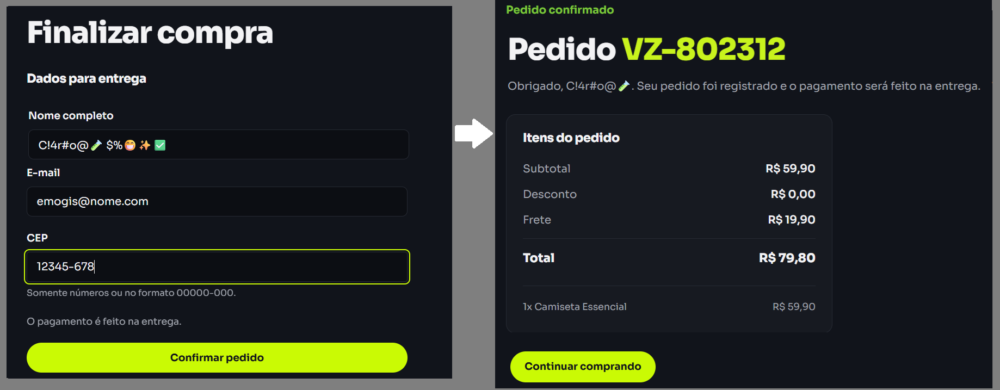

# Bugs reproduzidos nesta execução

Os relatos abaixo se baseiam nas verificações da [Verzel Store](https://verzel-store.qa-test-verzel-store.workers.dev/) pela interface e pela API, comparadas com a [documentação oficial](https://verzel-store.qa-test-verzel-store.workers.dev/documentacao). A severidade alta dos BUG-01/02 reflete impacto direto no preço ou na quantidade permitida; a severidade média do BUG-03 reflete dados de entrega fora da regra documentada. Não presumimos causa interna da aplicação.

## BUG-01

**Frete de R$ 19,90 cobrado quando subtotal é exatamente R$ 200,00.** Critério CA06; severidade **alta**; prioridade sugerida **alta**.

**Pré-condição:** carrinho novo, sem cupom. **Passos:** adicionar duas unidades de Mochila Urbana 20L (P005, R$ 100,00 cada); abrir carrinho. Repetir `POST /api/carrinho/calcular` com `{"itens":[{"produtoId":"P005","quantidade":2}]}` e `POST /api/pedidos` com o mesmo item e cliente válido.

**Esperado:** frete R$ 0,00, `freteGratis: true`, total R$ 200,00, sem aviso de valor faltante. A documentação diz “a partir de R$ 200,00, inclusive”.

**Observado:** interface e as duas respostas da API cobram frete R$ 19,90 e total R$ 219,90. O cálculo devolveu `valorFaltanteFreteGratis: 0` junto de `freteGratis: false`; a tela mostrou “Faltam R$ 0,00 para o frete grátis.” O pedido foi confirmado com o mesmo frete cobrado.

**Impacto:** cliente paga R$ 19,90 além do valor anunciado para um carrinho exatamente no limite. O cenário com R$ 199,90 passou, e R$ 219,80 com cupom continuou com frete grátis; a falha observada concentra-se na borda inclusiva.

**Evidências:** [cálculo real](../evidencias/api/API-07.json), [pedido real](../evidencias/api/API-24.json), [captura automatizada](../evidencias/ui/UI-02-frete-limite.png), [captura manual](../evidencias/manuais/CA06.png) e testes API-07/API-24/UI-02 no [relatório Playwright](../evidencias/relatorio-playwright/index.html). O cenário [CT07](../cenarios/frete.feature) permanece reprovado.

*Captura manual do CA06: mesmo com cupom, a regra de frete deve considerar o subtotal anterior ao desconto.*

## BUG-02

**API aceita seis unidades do mesmo produto no cálculo e na confirmação.** Critério CA10; severidade **alta**; prioridade sugerida **alta**.

**Pré-condição:** produto P001 disponível e cliente válido para o pedido. **Passos:** enviar `POST /api/carrinho/calcular` com `{"itens":[{"produtoId":"P001","quantidade":6}]}`; repetir em `POST /api/pedidos` incluindo nome, e-mail e CEP válidos.

**Esperado:** os dois endpoints respondem 422 com `erro.codigo: QUANTIDADE_MAXIMA_EXCEDIDA` e campo `itens[0].quantidade`. A documentação limita cada produto a cinco unidades, na interface e na API.

**Observado:** cálculo respondeu 200 com seis unidades e subtotal R$ 359,40; pedido respondeu 201 com número fictício e seis unidades. Pela interface comum, os controles bloquearam a sexta unidade (UI-03 aprovado), logo o desvio reproduzido está na API.

**Impacto:** um cliente da API consegue confirmar pedido fora do limite documentado. O teste com cinco unidades e o teste com cinco de cada um de dois produtos passaram, distinguindo limite por produto de limite total.

**Evidências:** [cálculo real](../evidencias/api/API-10.json), [pedido real](../evidencias/api/API-11.json), [captura automatizada do limite na interface](../evidencias/ui/UI-03-limite-cinco.png), [captura manual da API](../evidencias/manuais/CA10.png) e testes API-10/API-11 no [relatório Playwright](../evidencias/relatorio-playwright/index.html). O cenário [CT12](../cenarios/quantidade.feature) permanece reprovado.

*Captura manual do CA10: a imagem compara o limite na interface com uma chamada ao cálculo da API; o pedido com seis unidades está comprovado separadamente em API-11.*

## BUG-03

**Checkout confirma pedidos com nome formado apenas por emojis ou sem sobrenome válido.** Regra adicional de cadastro do cliente; severidade **média**; prioridade sugerida **média**.

**Pré-condição:** carrinho com uma Camiseta Essencial (P001), e-mail e CEP válidos. **Passos:** no checkout, preencher Nome completo com `😀 😃`; repetir com `Jorge !@` e confirmar. Repetir as massas em `POST /api/pedidos` com o mesmo produto e dados válidos nos outros campos.

**Esperado:** a interface informa “Informe nome e sobrenome.” e não confirma o pedido; a API responde 422 `DADOS_INVALIDOS`. A documentação exige nome e sobrenome. A regra não proíbe todo caractere especial em nomes; o problema testado é a ausência de partes válidas do nome.

**Observado:** a interface confirmou pedidos com os dois valores. A API respondeu 201 e preservou os nomes enviados. Os números de pedido são fictícios e variam entre execuções. Uma massa de controle com apenas `Jorge` recebeu 422 no [API-28](../evidencias/api/API-28.json), com os demais campos válidos, o que distingue o caso de ausência de separação.

**Impacto:** o checkout aceita dados de entrega que não atendem à regra documentada de nome e sobrenome. Não há evidência de impacto em preço ou de vulnerabilidade de segurança.

**Evidências:** [API-25](../evidencias/api/API-25.json), [API-26](../evidencias/api/API-26.json), capturas [UI-07 entrada](../evidencias/ui/UI-07-nome-invalido-entrada.png) e [confirmação](../evidencias/ui/UI-07-nome-invalido-confirmacao.png), [UI-08 entrada](../evidencias/ui/UI-08-nome-invalido-entrada.png) e [confirmação](../evidencias/ui/UI-08-nome-invalido-confirmacao.png), além dos testes reprovados no [relatório Playwright](../evidencias/relatorio-playwright/index.html). A [verificação manual](execucao-manual.md) tem [captura própria](../evidencias/manuais/nome-emoji-caracteres.png).

*Captura manual do checkout: pedido confirmado com caracteres especiais e emojis no lugar de nome e sobrenome válidos.*
